# Схема электрическая функциональная

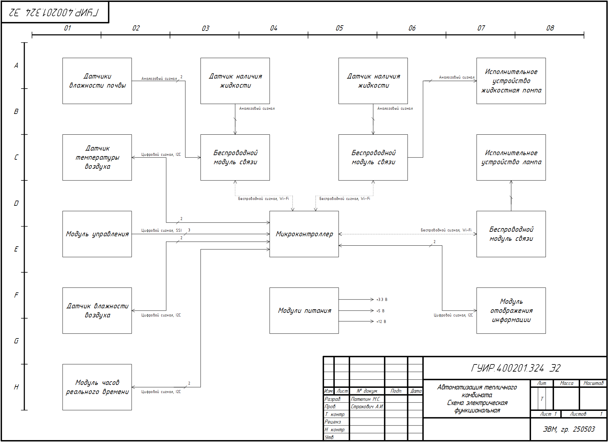

# Схема электрическая принципиальная
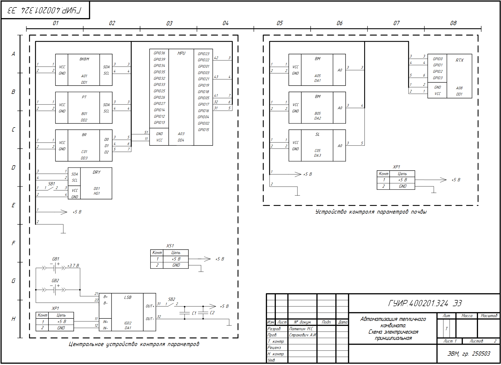

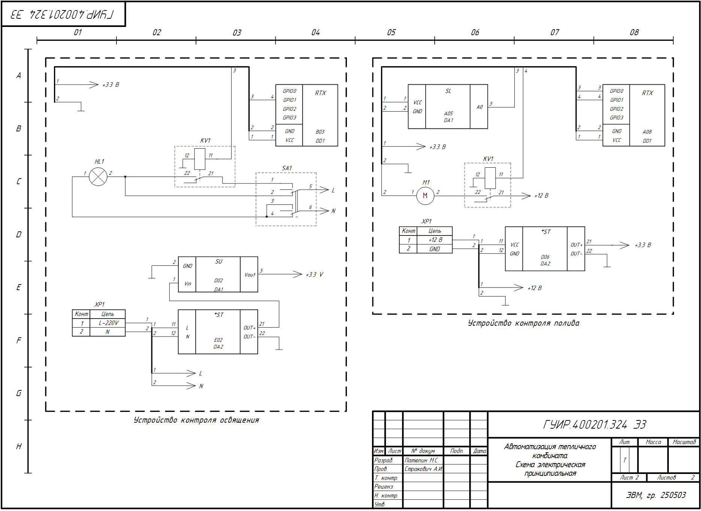

# Схема программы

# Руководство пользователя

## Начало работы

Для обеспечения работы системы автоматизации тепличного комбината необходимо:

1. Подключить устройство контроля освещения к бытовой розетке 220 В.
2. Подключить источник питания (12 В, 1 А) к разъему питания, насос к выходному разъему. Разместить погружной насос в бак для воды, датчик наличия жидкости разместить на наружной стенке бака на 1–2 см выше положения насоса.
3. Подключить питание к устройству контроля параметров почвы. Разместить датчики влажности земли в разные участки грунта, датчик перелива разместить под поддоном сбора капель.
4. Переключить тумблер разрешения дисплея в положение «включено», затем также тумблер питания.

На главном экране дисплея (см. рисунок 1) предоставлена следующая информация:
- Дата и текущее время
- Текущий статус системы (ожидание, полив, дополнительное освещение, полив и дополнительное освещение)
- Обработанные данные с датчиков влажности почвы
- Температура окружающей среды
- Наличие перелива и воды в баке

Тройным нажатием на модуль управления (энкодер) можно проверить доступность удаленных устройств (см. рисунок 2).

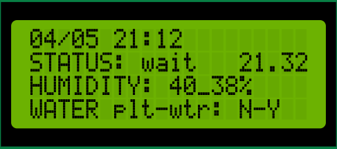

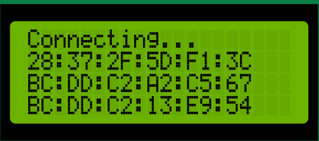

## Конфигурация устройства

Модуль управления — энкодер. Взаимодействие осуществляется следующим образом:

- Нажатие + поворот — изменение значения
- Поворот вправо — смещение курсора вниз
- Поворот влево — смещение курсора вверх
- 2 быстрых нажатия — выход из меню настроек, отключение подсветки
- 3 быстрых нажатия — вывод состояния подключения и подключенных устройств (см. рисунок 2)

Страницы меню расположены циклически:
- Основной экран, отображающий информацию о системе
- Настройка первого датчика влажности почвы
- Настройка второго датчика влажности почвы
- Настройка полива
- Настройка освещения

### Конфигурирование первого датчика влажности почвы

Настройка первого датчика влажности почвы (см. рисунок 3):

1. **Set value air** — калибровка сухого датчика в воздухе. Вызывается одновременным нажатием и поворотом вправо. Время калибровки: 10 секунд.
2. **Set value water** — калибровка датчика, находящегося в воде. Вызывается одновременным нажатием и поворотом вправо. Время калибровки: 10 секунд.
3. **Set control val** — установка контрольного значения, при падении показаний датчика ниже которого почва считается сухой и требующей полива.

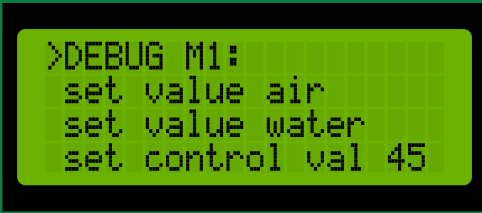

### Конфигурирование второго датчика влажности почвы

Настройка второго датчика влажности почвы (см. рисунок 4):

1. **Set value air** — калибровка сухого датчика в воздухе. Вызывается одновременным нажатием и поворотом вправо. Время калибровки: 10 секунд.
2. **Set value water** — калибровка датчика, находящегося в воде. Вызывается одновременным нажатием и поворотом вправо. Время калибровки: 10 секунд.
3. **Set control val** — установка контрольного значения, при падении показаний датчика ниже которого почва считается сухой и требующей полива.

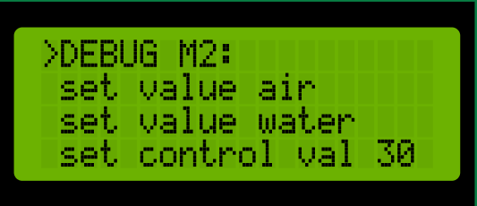

### Конфигурирование полива

Полив возможен при следующих условиях: достижимость устройства контроля полива, отсутствие перелива, наличие воды в баке. Пункты меню:

1. **Тип auto** (см. рисунок 5): Включение полива при падении значения с хотя бы одного датчика влажности почвы ниже контрольного значения; выключение при достижении хотя бы одним датчиком значения max % или по истечении таймера time (при установке 0 — время не ограничено).
2. **Тип time** (см. рисунок 6): Полив на протяжении времени time, каждые period секунд.
3. **Полив выключен** (см. рисунок 7).

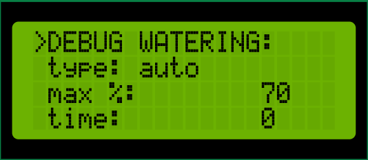

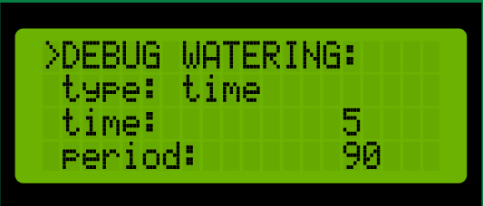

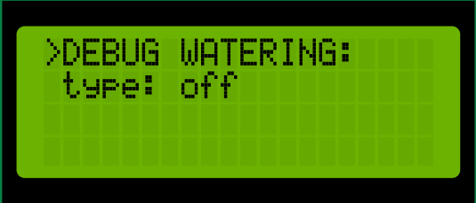

### Конфигурирование освещения

Освещение возможно при достижимости устройства контроля освещения. Пункты меню:

1. **Управление по времени** (см. рисунок 8): Включение освещения при достижении времени start, отключение при достижении времени end. Шаг изменения значения: 15 минут.
2. **Освещение отключено** (см. рисунок 9).

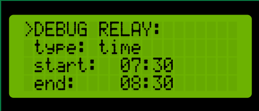

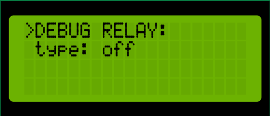

## Дополнительный модуль управления

Дополнительный модуль управления представлен в виде мобильного приложения для ОС Android.

Главный экран предоставляет информацию о проекте и доступ к боковому меню (см. рисунок 10).

Меню настроек позволяет выбрать текущее устройство для просмотра или добавить новое (см. рисунок 11).

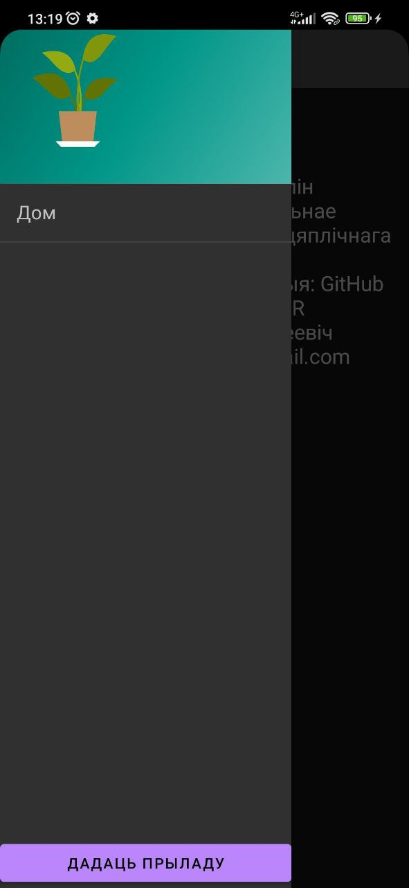

При добавлении нового устройства необходимо указать:
- Локальное имя
- Тип устройства
- IP-адрес устройства в локальной сети

Окно добавления нового устройства показано на рисунке 12.

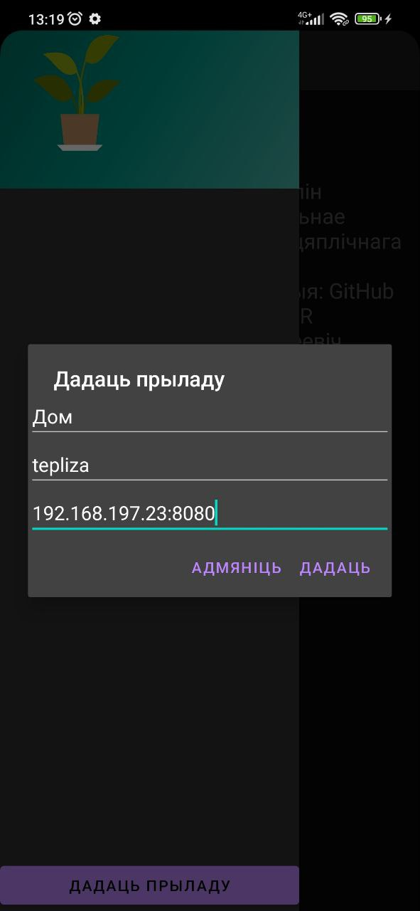

При нажатии на имя устройства в меню настроек выполняется переход на персональное меню (см. рисунок 13). На персональном окне предоставлена информация:
- Тип устройства, время последнего обновления
- График зависимости влажности почвы от времени
- Состояние устройств-исполнителей и возможность его изменения
- Текущие данные с датчиков влажности почвы
- Температура и влажность окружающей среды
- Текущее состояние перелива и наличия жидкости в баке

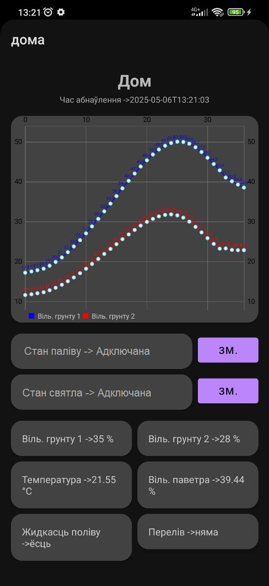
